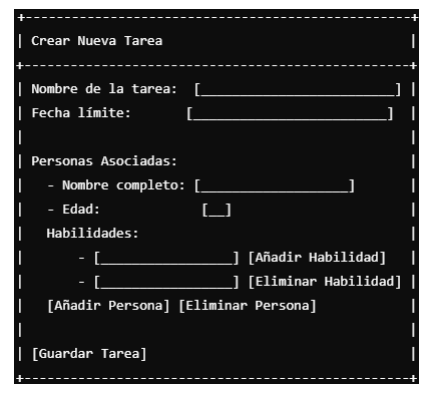
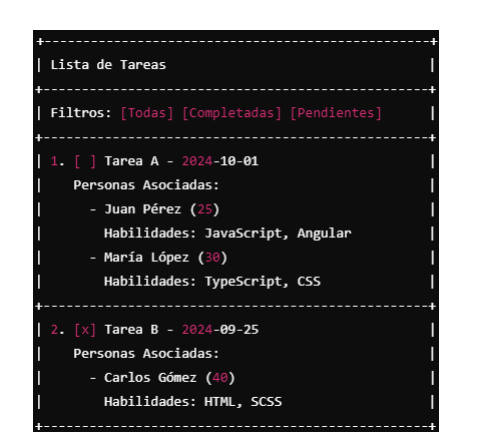

# GestionTareasPersonas

This project was generated with [Angular CLI](https://github.com/angular/angular-cli) version 16.

## Development server

Run `ng serve` for a dev server. Navigate to `http://localhost:4200/`. The application will automatically reload if you change any of the source files.

## Code scaffolding

Run `ng generate component component-name` to generate a new component. You can also use `ng generate directive|pipe|service|class|guard|interface|enum|module`.

## Build

Run `ng build` to build the project. The build artifacts will be stored in the `dist/` directory.

## Running unit tests

Run `ng test` to execute the unit tests via [Karma](https://karma-runner.github.io).

## Running end-to-end tests

Run `ng e2e` to execute the end-to-end tests via a platform of your choice. To use this command, you need to first add a package that implements end-to-end testing capabilities.

## Further help

To get more help on the Angular CLI use `ng help` or go check out the [Angular CLI Overview and Command Reference](https://angular.io/cli) page.

Contenido
Problema .................................................................................................................................................2
Requerimientos .......................................................................................................................................2
InterfazGrafica ........................................................................................................................................3
Tecnologías..............................................................................................................................................4
Validaciones adicionales..........................................................................................................................4
Consideraciones generales ......................................................................................................................4

Problema
Se desea implementar una aplicación web en Angular 16 que permita gestionar tareas y personas
asociadas a ellas. La aplicación debe contar con las siguientes funcionalidades:
1. Crear tareas.
2. Listar tareas creadas.
3. Marcar tareas como completadas.
4. Filtrar tareas por estado (completadas o pendientes).
5. Asignar personas a cada tarea, con sus nombres completos, edades y habilidades.
6. Añadir y eliminar personas de las tareas utilizando botones para estas acciones.
7. Añadir y eliminar habilidades para cada persona utilizando botones para estas acciones.
8. Implementar un formulario reactivo con validaciones, incluyendo la validación de
arreglos y arreglos anidados.
Las personas asociadas a una tarea deben tener los siguientes atributos:
• Nombre completo (obligatorio, mínimo 5 caracteres, no puede repetirse entre las
personas de la misma tarea).
• Edad (obligatorio, mayor de 18 años).
• Habilidades (lista de habilidades asociadas a la persona, debe tener al menos una
habilidad).
Se deben utilizar arreglos de objetos para almacenar y gestionar las personas asociadas a las tareas,
así como un arreglo anidado para gestionar las habilidades de cada persona.

Requerimientos
1. Interfaz Gráfica:
o Crear una interfaz gráfica de usuario utilizando Angular 16 que permita gestionar las
tareas, personas y habilidades asociadas.
o Utilizar formularios reactivos con validaciones, gestionando correctamente el arreglo
de personas y el arreglo anidado de habilidades.
o Implementar componentes standalone en al menos uno de los componentes.
o Aplicar principios de diseño Mobile First para que la interfaz sea responsiva.
2. Gestión del Estado:
o Utilizar un servicio en Angular para gestionar el estado de las tareas, personas y
habilidades
o Las tareas y personas deben almacenarse en un arreglo de objetos, y las habilidades
en un arreglo anidado dentro de cada persona.
o Opcional: Utilizar NgRx para gestionar el estado global de la aplicación.
3. Consumo de API REST (Opcional):
o Implementar el consumo de una API REST para obtener y almacenar las tareas y
personas asociadas. Puedes utilizar jsonplaceholder.typicode.com/todos como API de
© Derechos Reservados – VELAIO S.A.S. 2024
ejemplo.
Interfaz Grafica
La aplicación debe tener las siguientes funcionalidades visibles en la interfaz gráfica:
1. Pantalla de Creación de Tareas:
o Formulario para agregar una nueva tarea con nombre, fecha límite, personas
asociadas y botones para añadir o eliminar personas y habilidades.
o Validaciones para los campos del formulario, incluyendo validaciones sobre el arreglo
de personas y el arreglo anidado de habilidades.
Ejemplo de wireframe en modo carácter:

2. Pantalla de Listado de Tareas:
o Mostrar todas las tareas creadas con la posibilidad de filtrar por tareas completadas o
pendientes.
o Mostrar las personas asociadas a cada tarea.
Ejemplo de wireframe en modo carácter:

Tecnologías
• Lenguaje Backend: No requerido para esta prueba (Opcional si decides implementar la API
REST).
• Framework de Frontend: Angular 16 (Obligatorio).
• Gestión del Estado: Utilizar un servicio de Angular o NgRx (Opcional).
• Repositorio: GitHub.

Validaciones adicionales
1. Validación del Arreglo de Personas:
o El nombre no puede repetirse entre las personas asociadas a la misma tarea.
o La edad debe ser mayor a 18 años.
o Cada persona debe tener al menos una habilidad.
2. Validación del Arreglo Anidado (Habilidades):
o El campo de habilidad no puede estar vacío.
o Cada persona debe tener al menos una habilidad.
Consideraciones generales
• La prueba debe ser realizada por una sola persona.
• No buscamos una solución absolutamente perfecta, buscamos la solución de cada 

persona respecto a su nivel.
• La solución será evaluada por un experto de VELAIO, quien valorará tanto la
implementación técnica como la capacidad de defensa del código.
• Para que la aplicación desarrollada por el candidato sea considerada en el proceso
de selección, debe publicarse en un repositorio de GitHub.
• Tiempo estimado: 48 horas para completar la prueba.
• El candidato debe sustentar su solución creando un video, el cual deberá subirse
de manera privada a una plataforma como YouTube o Google Drive para su
entrega.
